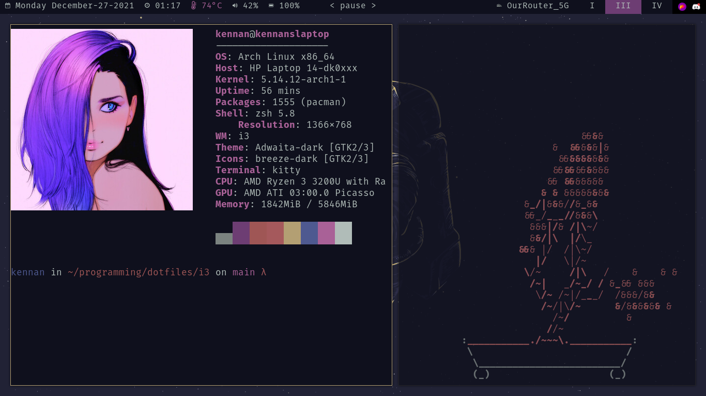

# Dotfiles

Welcome to the official Kennan Hunter dotfile repo

## Screenshots

## Installation process

`cp ./vim/.vimrc ~/.vimrc`

`cp ./zsh/.zshrc ~/.zshrc`

`cp ./x/.xinitrc ~/.xinitrc`

`cp -r ./i3 ./kitty ./alacritty ./polybar ./wal ./rofi ./conky ./neofetch ~/.config`

`cp -r ./wallpaper-scripts ~/bin`

## Dependencies

-   zsh
-   alacritty
-   kitty
-   vim
-   i3-gaps
-   polybar
-   pywal
-   pywal-discord
-   pywal-fox
-   betterlockscreen
-   dmenu
-   rofi
-   firefox
-   mopidy
-   discord
-   betterdiscord

## Other repos

[Firefox Start Page](https://github.com/KennanHunter/startpage)
